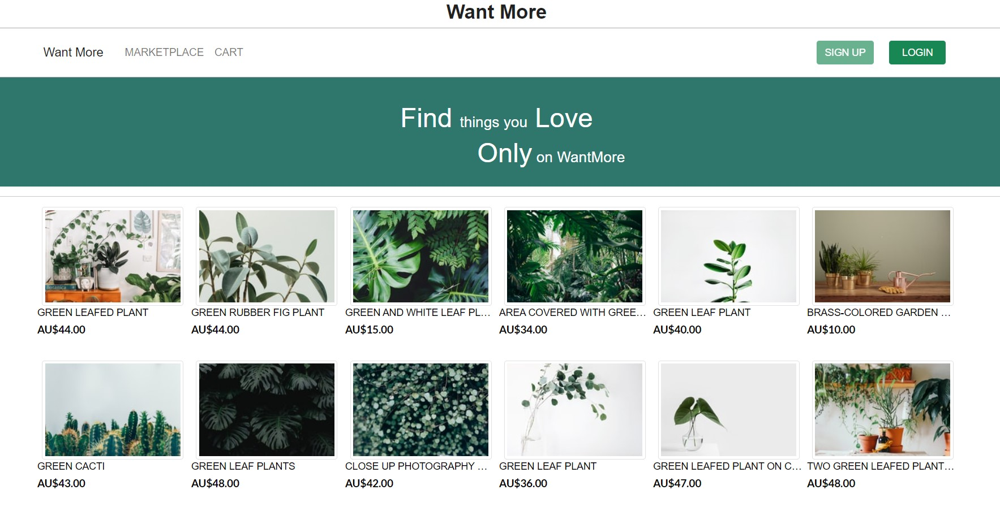
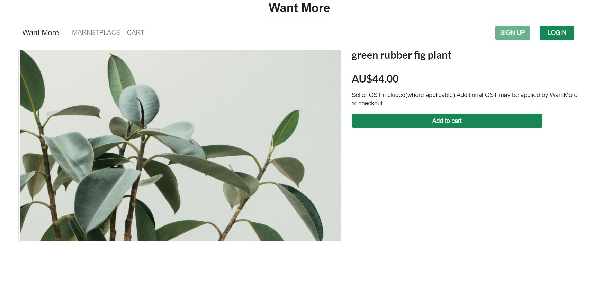
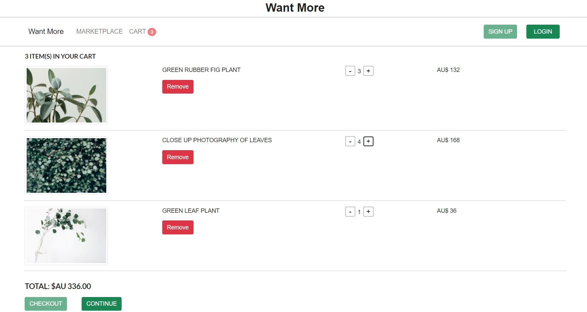

## About this project
This project is an ecommerce site, developed using JavaScript, ReactJS, HTML, CSS and Bootstrap.

## Project screenshots
### 1. Home Page


### 2. Product Detail Page


### 3. Shopping Cart


## Run this project

### 1. Run the application

In the project directory, use command: 
```
npm start
```
OR
```
yarn start
```
Open [http://localhost:3000](http://localhost:3000) to view it in the browser.

### 2. Start json server

The authentication system on the website was implemented using json server for now. \
To start the json server, make sure you are in the project directory and use command:

```
json-server --watch db.json -m ./node_modules/json-server-auth --port 3001 
```

NOTE: The application and json server MUST run on the seperate port. 
